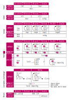

# 第7章 プロセッサーを理解する

第2章と第3章の理論は、正しい並行コードを書くために必要なものですが、さらに、プロセッサレベルで実際に何が行われているのかをおおよそ理解することも非常に有効です。本章では、アトミック演算をコンパイルするマシン命令、プロセッサ・アーキテクチャの違い、弱いバージョンの`compare_exchange`が存在する理由、個々の命令の最下層におけるメモリ順序の意味、そしてキャッシングがこれらとどう関係しているのかを探ります。

この章の目的は、すべてのプロセッサ・アーキテクチャの関連する詳細をすべて理解することではありません。そのためには、本棚いっぱいの本が必要で、その多くはおそらく未執筆か公開されていないでしょう。その代わり、本章の目標は、アトミックがプロセッサレベルでどのように機能するかについての一般的な考え方を身につけ、アトミックを含むコードを実装し最適化する際に、より多くの情報に基づいた意思決定を行えるようにすることです。そしてもちろん、舞台裏で何が起こっているのかという好奇心を満たすため、抽象的な理論から一旦離れることでもあります。

ここでは、できるだけ具体的に説明するために、2つのプロセッサ・アーキテクチャに焦点を当てます：

x86-64:
ノートパソコン、デスクトップパソコン、サーバー、ゲーム機などの大半で使用されているIntelとAMDのプロセッサが実装するx86アーキテクチャの64ビット版です。元々16ビットのx86アーキテクチャとその非常に人気のある32ビット拡張はインテルによって開発されましたが、現在x86-64と呼ばれている64ビット版は、当初AMDによって開発された拡張で、しばしばAMD64と呼ばれています。インテルも独自の64ビットアーキテクチャであるIA-64を開発したが、結局はAMDのより人気のあるx86拡張機能を採用した（IA-32e、EM64T、後にIntel 64という名称になる）。

ARM64：
ARMアーキテクチャの64ビット版で、ほぼすべての最新モバイル機器、高性能組み込みシステム、そして最近のノートパソコンやデスクトップパソコンで使用されるようになってきています。AArch64とも呼ばれ、ARMv8の一部として導入された。ARMの初期バージョン（32ビット）は、多くの点で類似していますが、さらに幅広いアプリケーションで使用されています。自動車から電子COVID検査まで、想像できるあらゆる種類の組み込みシステムで人気のあるマイクロコントローラの多くは、ARMv6とARMv7をベースにしています。

この2つのアーキテクチャは、多くの点で似て非なるものです。最も重要なのは、アトミックに対するアプローチが異なることです。この2つのアーキテクチャでアトミックがどのように動作するかを理解することで、他の多くのアーキテクチャに適用できる、より一般的な理解を得ることができます。

## プロセッサの命令

コンパイラの出力、つまりプロセッサが実行する正確な命令をよく観察することで、プロセッサレベルでどのように動作するかをおおよそ理解することができます。

---

### Note

RustやC言語などのコンパイル言語で書かれたソフトウェアをコンパイルする場合、そのコードは、最終的にプログラムを実行するプロセッサが実行できる機械命令に変換されます。これらの命令は、プログラムをコンパイルするプロセッサのアーキテクチャに非常に固有です。

機械語コードとも呼ばれるこれらの命令は、バイナリ形式で符号化されており、私たち人間には全く読めません。アセンブリは、これらの命令を人間が読むことができるように表現したものです。すべての命令は1行のテキストで表現され、通常は命令を識別するための1つの単語または頭文字で始まり、その後に引数またはオペランドが続く。アセンブラは、テキスト表現をバイナリ表現に変換し、逆アセンブラはその逆を行います。

Rustのような言語からコンパイルした後、元のソースコードの構造のほとんどはなくなってしまいます。最適化のレベルによっては、関数や関数呼び出しはまだ認識できるかもしれません。しかし、構造体や列挙型などの型はバイトとアドレスに縮小され、ループや条件分岐は基本的なジャンプ命令や分岐命令を含む平面構造に縮小されています。

ここで、あるアーキテクチャのプログラムのごく一部のアセンブリのスニペットを見てみましょう：

```text
ldr x, 1234 // load from memory address 1234 into x
li y, 0     // set y to zero
inc x       // increment x
add y, x    // add x to y
mul x, 3    // multiply x by 3
cmp y, 10   // compare y to 10
jne -5      // jump five instructions back if not equal
str 1234, x // store x to memory address 1234
```

この例では、xとyはレジスタの名前です。レジスタはメインメモリではなくプロセッサの一部であり、通常は1つの整数またはメモリアドレスを保持します。64ビットアーキテクチャでは、一般に64ビットの大きさです。レジスタの数はアーキテクチャによって異なりますが、通常は非常に限られています。レジスタは基本的に計算の一時的なスクラッチパッドとして使用され、メモリに保存する前に中間的な結果を保存する場所として使用されます。

上の例の1234と-5のように、特定のメモリアドレスを指す定数は、多くの場合、より人間が読みやすいラベルに置き換えられます。アセンブラは、アセンブリをバイナリ・マシンコードに変換する際に、これらを実際のアドレスに自動的に置き換えます。

ラベルを使用すると、先ほどの例は次のようになります：

```text
         ldr x, SOME_VAR
         li y, 0
my_loop: inc x
         add y, x
         mul x, 3
         cmp y, 10
         jne my_loop
         str SOME_VAR, x
```

ラベルの名前はアセンブリの一部でしかなく、バイナリのマシンコードの一部ではないので、逆アセンブラは元々どんなラベルが使われていたかを知らず、ほとんどの場合、label1やvar2といった意味のない生成名を使うだけでしょう。

すべての異なるアーキテクチャのアセンブリに関する完全なコースは、本書の範囲外ですが、この章を読むための前提条件ではありません。アセンブリを書くのではなく、アセンブリを読むだけなので、ごく一般的な理解で例を理解するには十分すぎるほどです。各例題の関連指示は、アセンブリの経験がなくてもフォローできるように、十分に詳細に説明します。

---

Rustコンパイラが生成する正確なマシンコードを見るには、いくつかの選択肢があります。通常通りコードをコンパイルし、ディスアセンブラ（`objdump`など）を使って、生成されたバイナリファイルをアセンブリに戻すことができます。コンパイラがコンパイル時に生成するデバッグ情報を使って、ディスアセンブラはRustソースコードの元の関数名に対応するラベルを生成することができます。この方法の欠点は、コンパイル対象の特定のプロセッサアーキテクチャをサポートする逆アセンブラが必要なことです。Rustコンパイラは多くのアーキテクチャをサポートしていますが、多くの逆アセンブラは、コンパイルされた1つのアーキテクチャしかサポートしていません。

より直接的な方法としては、rustcに`--emit=asm`フラグを指定して、バイナリの代わりにアセンブリを生成するようコンパイラに依頼する方法があります。この方法の欠点は、生成される出力に無関係な行が多く含まれ、必要のないアセンブラやデバッグツールのための情報が含まれていることです。

`cargo-show-asm`のような素晴らしいツールがあり、cargoと統合して、正しいフラグでcrateをコンパイルし、興味のある関数の関連アセンブリを見つけ、実際の命令を含む関連行を強調表示するプロセスを自動化することができます。

比較的小さなスニペットの場合、最も簡単で推奨される方法は、Matt Godboltによる優れたCompiler Explorerのようなウェブサービスを使用することです。このウェブサイトでは、Rustを含む多くの言語でコードを書くことができ、選択したコンパイラのバージョンでコンパイルされた対応するアセンブリを直接見ることができます。最適化後も対応関係がある限り、Rustのどの行とアセンブリのどの行が対応しているかを色分けして表示することもできます。

異なるアーキテクチャのアセンブリを見たいので、Rustコンパイラがコンパイルするターゲットを正確に指定する必要があります。ここでは、x86-64には`x86_64-unknown-linux-musl`を、ARM64には`aarch64-unknown-linux-musl`を使用します。これらはすでにコンパイラエクスプローラで直接サポートされています。ローカルでコンパイルする場合、例えば`cargo-show-asm`や上記の他の方法を使用する場合、これらのターゲットにRust標準ライブラリがインストールされていることを確認する必要があり、これは通常`rustup target add`を使用して行われます。

どのような場合でも、コンパイルするターゲットは `--target` コンパイラフラグで選択します。例えば、`--target=aarch64-unknown-linux-musl`です。ターゲットを指定しない場合は、現在使用しているプラットフォームが自動的に選択されます。(コンパイラエクスプローラの場合は、それがホストされているプラットフォームで、現在は`x86_64-unknown-linux-gnu`です。)。

さらに、`-O`フラグを有効にすることで最適化が有効になり、オーバーフローのチェックが無効になるため、これから見ていく小さな関数のアセンブリの生成量を大幅に減らすことができるので、最適化を有効にする（Cargoを使う場合は`--release`）ことが推奨されます。

試しに、以下の関数のx86-64とARM64のアセンブリを見てみましょう：

```rust
pub fn add_ten(num: &mut i32) {
    *num += 10;
}
```

上記のいずれかの方法でコンパイラフラグとして`-O --target=aarch64-unknown-linux-musl` を使用すると、ARM64では次のようなアセンブリ出力が得られます：

```text
add_ten:
    ldr w8, [x0]
    add w8, w8, #10
    str w8, [x0]
    ret
```

`x0`レジスタには、関数の引数である`num`、つまり10ずつインクリメントするi32のアドレスが格納されています。まず、`ldr`命令でそのメモリアドレスから32ビット値を`w8`レジスタにロードします。そして、`add`命令で`w8`に10を加算し、その結果を`w8`に格納し直します。そして、その後、`str`命令で`w8`レジスタを同じメモリアドレスに戻して格納します。最後に、`ret`命令で関数の終わりを示し、プロセッサがジャンプバックして`add_ten`を呼び出した関数を続行するようにします。

全く同じコードを`x86_64-unknown-linux-musl`用にコンパイルすると、代わりに次のようなものが得られます：

```text
add_ten:
    add dword ptr [rdi], 10
    ret
```

今回は、`num`の引数に`rdi`というレジスタが使われています。さらに興味深いことに、x86-64では、ARM64では3命令必要な値のロード、インクリメント、ストアを、1つの`add`命令で行うことができます。

これは、x86のようなCISC（Complex Instruction Set Computer）アーキテクチャの場合、通常、このようなことが起こります。このようなアーキテクチャの命令は、レジスタを操作したり、あるサイズのメモリを直接操作したりと、多くのバリエーションがあることが多い。(アセンブリの`dword`は32ビット演算を指定する)。

これに対して、ARMのような縮小命令セットコンピュータ（RISC）アーキテクチャでは、通常、非常に少ないバリエーションでよりシンプルな命令セットを持ちます。ほとんどの命令はレジスタに対してのみ動作可能で、メモリへのロードとストアは別の命令を必要とする。このため、プロセッサをよりシンプルにすることができ、コストの削減や、場合によっては性能の向上を実現することができます。

この違いは、特にアトミックなfetch-and-modify命令で顕著に現れます。

---

### Note-1

コンパイラは一般的に非常に賢いのですが、特にアトミック演算が含まれる場合、常に最適なアセンブリを生成するわけではありません。もしあなたが実験をしていて、アセンブリの一見不必要な複雑さに戸惑うようなケースを見つけたら、それはコンパイラの将来のバージョンに最適化の機会があることを意味することが多いのです。

---

## Load and Store

より高度な内容を説明する前に、まず最も基本的なアトミック操作であるロードとストアに使用される命令について見てみましょう。

以下のように、x86-64とARM64の両方で、`&mut i32`を介した通常の非アトミックストアは、たった1命令で完了します：

- Rust Source

```rust
pub fn a(x: &mut i32) {
    *x = 0;
}
```

- Compiled x86-64

```text
a:
    mov dword ptr [rdi], 0
    ret
```

- Compiled ARM64

```text
a:
    str wzr, [x0]
    ret
```

x86-64では、非常に汎用性の高いmov命令を使用して、データをある場所から別の場所にコピー（「move」）します。この場合、ゼロ定数からメモリにコピーします。ARM64では、32ビットレジスタをメモリに格納するためにstr（store register）命令を使用します。この場合、常にゼロを含む特別な`wzr`レジスタが使用されます。

代わりに`AtomicI32`へのリラックスしたアトミックストアを使用するようにコードを変更すると、次のようになります：

- Rust Source

```rust
pub fn a(x: &AtomicI32) {
    x.store(0, Relaxed);
}
```

- Compiled x86-64

```text
a:
    mov dword ptr [rdi], 0
    ret
```

- Compiled ARM64

```text
a:
    str wzr, [x0]
    ret
```

やや意外かもしれないが、アセンブリは非アトミックバージョンと同じである。結局のところ、`mov`命令と`str`命令はすでにアトミックだったのです。発生するか、まったく発生しないかのどちらかであった。どうやら、ここでの`&mut i32`と`&AtomicI32`の違いは、コンパイラのチェックと最適化にのみ関係し、プロセッサにとっては無意味であるようです-少なくとも、この2つのアーキテクチャでのリラックスしたストア操作においては。

同じことが、緩和されたロード操作について見るときにも起こります：

### 非アトミックロード

- Rust Source

```rust
pub fn a(x: &i32) -> i32 {
    *x
}
```

- Compiled x86-64

```text
a:
    mov eax, dword ptr [rdi]
    ret
```

- Compiled ARM64

```text
a:
    ldr w0, [x0]
    ret
```

### アトミックロード

- Rust Source

```rust
pub fn a(x: &AtomicI32) -> i32 {
    x.load(Relaxed)
}
```

- Compiled x86-64

```text
a:
    mov eax, dword ptr [rdi]
    ret
```

- Compiled ARM64

```text
a:
    ldr w0, [x0]
    ret
```

x86-64では、`mov`命令が再び使用され、今度はメモリから32ビット`eax`レジスタにコピーされる。ARM64では、`ldr`（load register）命令を使用して、メモリから`w0`レジスタに値をロードします。

---

### Note-2

32ビットの`eax`と`w0`レジスタは、関数の32ビット戻り値の受け渡しに使用します。(64ビット値の場合は、64ビットの`rax`、`x0`レジスタを使用します)。

---

プロセッサは、アトミックストアと非アトミックロードを区別していないようですが、Rustのコードでは、この違いを無視することはできません。Rust コンパイラは、&mut i32 を使用する場合、他のスレッドが同じ `i32` に同時にアクセスできないことを想定し、ストア操作の結果が対応する 1 つのストア命令にならないようにコードを変換または最適化する可能性があります。たとえば、非アトミック32ビットロードまたはストアが2つの別々の16ビット命令で実行されるのは、やや珍しいものの、完全に正しいことでしょう。

## Read-Modify-Write Operations

加算のようなリード・モディファイ・ライトの操作では、さらに興味深いことが起こります。本章の前半で述べたように、非原子的な読み取り-変更-書き込み操作は、ARM64のようなRISCアーキテクチャでは通常3つの別々の命令（読み取り、変更、書き込み）にコンパイルされますが、x86-64などのCISCアーキテクチャではしばしば1つの命令で実行することが可能です。この短い例では、そのことを実証しています：

- Rust Source

```rust
pub fn a(x: &mut i32) {
    *x += 10;
}
```

- Compiled x86-64

```text
a:
    add dword ptr [rdi], 10
    ret
```

- Compiled ARM64

```text
a:
    ldr w8, [x0]
    add w8, w8, #10
    str w8, [x0]
    ret
```

対応するアトミック演算を見る前に、今回は非アトミック版とアトミック版の違いが見られると考えるのが妥当だろう。ARM64版は、ロードとストアが別々のステップで行われるため、明らかにアトミックではありません。

アセンブリ自体からは直接わからないが、x86-64のバージョンもアトミックではない。`add`命令は、プロセッサによって裏で複数のマイクロ命令に分割され、値のロードと結果の保存が別々の手順で行われます。スレッド間でプロセッサコアを切り替えるのは一般に命令の間だけなので、シングルコアのコンピュータではこのようなことは関係ないだろう。しかし、複数のコアが並列に命令を実行する場合、1つの命令を実行するために必要な複数のステップを考慮せずに、すべての命令がアトミックに行われると考えることはもはやできません。

### x86 lock prefix

マルチコアシステムをサポートするために、インテルはロックと呼ばれる命令接頭辞を導入しました。これは、`add`などの命令に対して、その動作をアトミックにするための修飾語として使用されます。

ロックプレフィックスはもともと、プロセッサが命令の間、他のすべてのコアがメモリにアクセスするのを一時的にブロックすることを意味します。これは、他のコアからアトミックに見えるようにする簡単で効果的な方法ですが、アトミックな操作のたびに世界を停止するのは非常に非効率的な場合があります。新しいプロセッサでは、ロックプレフィックスがより高度に実装されており、他のコアが無関係なメモリ上で操作するのを止めず、特定のメモリが利用可能になるのを待つ間にコアが有用なことを行えるようになっています。

ロックプレフィックスは、`add`、`sub`、`and`、`not`、`or`、`xor`など、非常に限られた命令に対してのみ適用可能で、これらはすべてアトミックに実行できる非常に有用な操作である。アトミックなスワップ操作に対応する`xchg`（交換）命令には暗黙のロック接頭辞があり、ロック接頭辞に関係なく`lock xchg`として動作する。

前回の例を`AtomicI32`で操作するように変更して、`lock add`の動作を確認してみましょう：

- Rust Source

```rust
pub fn a(x: &AtomicI32) {
    x.fetch_add(10, Relaxed);
}
```

- Compiled x86-64

```text
a:
    lock add dword ptr [rdi], 10
    ret
```

予想通り、非アトミック版との違いはロックの接頭辞だけです。

上の例では、`fetch_add`の戻り値（演算前の`x`の値）を無視しています。しかし、その値を使うとなると、もはや`add`命令では不十分です。`add`命令は、更新された値がゼロかマイナスかといった、次の命令に役立つ情報を少しは提供できますが、完全な（元の、あるいは更新された）値を提供するものではありません。代わりに、別の命令を使うことができます：`xadd`（「交換と加算」）、これは元々ロードされていた値をレジスタに入れるものです。

`fetch_add`が返す値を返すようにコードを少し修正することで、その動作を確認することができます：

- Rust Source

```rust
pub fn a(x: &AtomicI32) -> i32 {
    x.fetch_add(10, Relaxed)
}
```

- Compiled x86-64

```text
a:
    mov eax, 10
    lock xadd dword ptr [rdi], eax
    ret
```

定数10の代わりに、値10を含むレジスタが使用されるようになりました。`xadd`命令では、そのレジスタを再利用して古い値を格納します。

残念ながら、`xadd`と`xchg`以外の、`sub`、`and`、`or`のようなロック接頭辞付き命令は、このようなバリエーションを持っていません。例えば、`xsub`命令もない。引き算の場合は、`xadd`が負の値で使えるので問題ない。しかし、`and`と`or`の場合は、そのような代替案はありません。

`fetch_or(1)`や`fetch_and(!1)`のように、1ビットだけに影響を与える`and`、`or`、`xor`演算には、`bts`（`bit test and set`）、`btr`（`bit test and reset`）、`btc`（`bit test and complement`）命令を使うことが可能です。これらの命令は、ロックプリフィックスも可能で、1ビットだけ変更し、その1ビットの前の値を条件付きジャンプなどの後続の命令で利用できるようにする。

これらの操作が複数のビットに影響する場合、1つのx86-64命令で表現することはできません。同様に、`fetch_max`と`fetch_min`の演算も、対応するx86-64命令がない。これらの操作には、単純な`lock prefix`とは異なる戦略が必要です。

### x86 compare-and-exchange instruction

第2章の「比較・交換演算」では、アトミックなfetch-and-modify演算を比較・交換ループとして実装できることを説明しました。これは、x86-64のアーキテクチャに（ロック接頭辞を付けられる）`cmpxchg`（比較・交換）命令があるため、コンパイラが1つの命令で表現できない演算に使用するものです。

前回の例を`fetch_add`から`fetch_or`に変更することで、この動作を確認することができます：

- Rust Source

```rust
pub fn a(x: &AtomicI32) -> i32 {
    x.fetch_or(10, Relaxed)
}
```

- Compiled x86-64

```text
a:
    mov eax, dword ptr [rdi]
.L1:
    mov ecx, eax
    or ecx, 10
    lock cmpxchg dword ptr [rdi], ecx
    jne .L1
    ret
```

最初のmov命令では、アトミック変数から`eax`レジスタに値がロードされます。続く`mov`命令と`or`命令では、その値を`ecx`にコピーし、バイナリ演算を適用して、`eax`に古い値、`ecx`に新しい値が格納されるようにします。その後の`cmpxchg`命令は、Rustの`compare_exchange`メソッドと全く同じ動作をする。第1引数は演算対象のメモリアドレス（アトミック変数）、第2引数（`ecx`）は新しい値、期待値は暗黙のうちに`eax`から取得し、戻り値は暗黙のうちに`eax`に格納されます。また、演算が成功したか否かに基づいて、後続の命令が条件分岐するために使用できるステータスフラグを設定する。この場合、`jne`（`jump if not equal`）命令で`.L1`ラベルにジャンプして戻り、失敗時に再試行します。

第2章の「比較・交換演算」で見たような、同等の比較・交換ループをRustで表現すると次のようになります：

```rust
pub fn a(x: &AtomicI32) -> i32 {
    let mut current = x.load(Relaxed);
    loop {
        let new = current | 10;
        match x.compare_exchange(current, new, Relaxed, Relaxed) {
            Ok(v) => return v,
            Err(v) => current = v,
        }
    }
}
```

このコードをコンパイルすると、`fetch_or`バージョンと全く同じアセンブリになります。このことから、少なくともx86-64では、あらゆる点で両者は本当に同等であることがわかります。

---

### Note-3

x86-64では、`compare_exchange`と`compare_exchange_weak`の間に違いはありません。どちらも`cmpxchg`命令をロックするようにコンパイルされます。

---

### Load-Linked and Store-Conditional Instructions

RISCアーキテクチャで比較・交換ループに最も近いのは、`load-linked/store-conditional`（`LL/SC`）ループです。`LL/SC`ループは、`load-linked`命令と`store-conditional`命令という2つの特殊な命令を組み合わせたもので、`load-linked`命令は通常の`ldr`命令とほぼ同じ動作をし、`store-conditional`命令は通常のストア命令とほぼ同じ動作をする。これらは2つ1組で使用され、両方の命令が同じメモリアドレスを対象とします。通常の`ldr`命令や`str`命令との大きな違いは、ストアが条件付きであることです。`load-linked`命令以降に他のスレッドがそのメモリを上書きした場合、メモリへのストアを拒否します。

この2つの命令により、メモリから値をロードして変更し、ロードしてから誰も値を上書きしていない場合にのみ、新しい値をストアして戻すことができます。もし失敗したら、再試行すればよい。一度成功すれば、中断されることなく、アトミックな操作であったということにできる。

1）一度に追跡できるメモリアドレスは1つだけ（1コアあたり）であること、（2）ストア条件には偽陰性が許されること、つまり、特定のメモリに何も変化がなくても、ストアに失敗することがあることです。

これにより、`LL/SC`ループのサイクルが数回増えるだけで、メモリへの変更を追跡する際の精度を低くすることができる。メモリへのアクセスは、バイト単位ではなく、64バイトの塊や1KB単位、あるいはメモリ全体として追跡することも可能です。メモリ追跡の精度が低いと、`LL/SC`ループの不要なサイクルが増え、性能が大幅に低下しますが、実装の複雑さも軽減されます。

極端な話、基本的な仮想のシングルコア・システムでは、メモリへの書き込みをまったく追跡しない戦略をとることができます。その代わりに、割り込みやコンテキストスイッチ（プロセッサが別のスレッドに切り替わる原因となるイベント）を追跡することができます。並列性のないシステムでこのようなイベントが発生しなかった場合、他のスレッドがメモリに触れることはなかったと考えることができます。もしそのような事象が発生した場合、最悪の事態を想定し、ストアを拒否し、次のループの繰り返しでより良い運が訪れることを祈るしかない。

### ARM load-exclusive and store-exclusive

ARM64では、少なくともARMv8の最初のバージョンでは、アトミックな`fetch-and-modify`や`compare-and-exchange`の操作を1つの命令で表現することはできない。RISCの性質に忠実に、ロードとストアのステップは、計算と比較から分離されています。

ARM64のロードリンク命令とストア条件付き命令は、`ldxr`（`load exclusive register`）と`stxr`（`store exclusive register`）と呼ばれています。また、`stxr`の代替として`clrex`（`clear exclusive`）命令を使用すると、何も記憶せずにメモリへの書き込みを追跡しなくなります。

これらの動作を確認するために、ARM64でアトミックな加算を行うとどうなるかを見てみましょう：

- Rsut SOurce

```rust
pub fn a(x: &AtomicI32) {
    x.fetch_add(10, Relaxed);
}
```

- Compiled ARM64

```text
a:
.L1:
    ldxr w8, [x0]
    add w9, w8, #10
    stxr w10, w9, [x0]
    cbnz w10, .L1
    ret
```

`ldr`命令、`add`命令、`str`命令という、以前（「Read-Modify-Write Operations」で）入手した非アトミックバージョンとよく似たものが出てきました。`ldr`命令と`str`命令は、その「排他的」な`LL/SC`バージョンに置き換えられ、新しい`cbnz`（非ゼロでの比較と分岐）命令が登場しました。`stxr`命令は、成功した場合は`w10`に0を、失敗した場合は1を格納する。`cbnz`命令は、失敗した場合、これを利用して全体の処理を再開します。

x86-64の`lock add`とは異なり、古い値を取り出すために特別なことをする必要がないことに注意してください。上の例では、操作に成功した後も古い値はレジスタw8に残っているので、`xadd`のような特殊な命令は必要ありません。

この`LL/SC`パターンは非常に柔軟で、`add`や`or`のような限られた演算だけでなく、事実上あらゆる演算に対応できます。`ldxr`命令と`stxr`命令の間に対応する命令を置くことで、アトミックな`fetch_divide`や`fetch_shift_left`を簡単に実装することができるのです。しかし、間に挟む命令の数が多すぎると、余計なサイクルが発生する可能性が高くなります。一般に、コンパイラは、`LL/SC`ループがほとんど成功せず、永遠に回転し続けることを避けるために、`LL/SC`パターン内の命令数をできるだけ少なくしようとします。

---

### Note-4

ARM64の後のバージョン、ARMv8.1の一部には、一般的なアトミック演算のための新しいCISCスタイル命令も含まれています。例えば、新しい`ldadd`（`load and add`）命令は、`LL/SC`ループを必要としないアトミックな`fetch_add`オペレーションと同等です。さらに、x86-64には存在しない`fetch_max`のような操作のための命令も含まれています。

また、`compare_exchange`に対応する`cas`（比較とスワップ）命令も含まれています。この命令を使うと、x86-64のように`compare_exchange`と`compare_exchange_weak`に差がなくなる。

`LL/SC`パターンは非常に柔軟で、一般的なRISCパターンにうまく適合していますが、これらの新しい命令は、特殊なハードウェアで最適化しやすくなるため、より高性能になる可能性があります。

---

### Compare-and-exchange on ARM

`compare_exchange`オペレーションは、比較に失敗した場合に`str`命令をスキップする条件分岐命令を使用することで、この`LL/SC`パターンに非常にうまく対応しています。それでは、生成されたアセンブリを見てみましょう：

- Rust Source

```rust
pub fn a(x: &AtomicI32) {
    x.compare_exchange_weak(5, 6, Relaxed, Relaxed);
}
```

- Compiled ARM64

```text
a:
    ldxr w8, [x0]
    cmp w8, #5
    b.ne .L1
    mov w8, #6
    stxr w9, w8, [x0]
    ret
.L1:
    clrex
    ret
```

---

### Note-5

通常、`compare_exchange_weak`オペレーションは、比較に失敗した場合に繰り返されるループの中で使用されることに注意してください。しかし、この例では、これを1回だけ呼び出し、その戻り値を無視することで、関連するアセンブリを邪魔されることなく表示することができます。

---

`ldxr`命令で値をロードすると、すぐに`cmp`（比較）命令で期待値である5と比較されます。値が期待通りでなかった場合、`b.ne`（`branch if not equal`）命令によって`.L1`ラベルにジャンプし、その時点で`clrex`命令を使用して`LL/SC`パターンを中止します。値が5であった場合、流れは`mov`命令と`stxr`命令を経て、新しい値である6をメモリに格納しますが、その間に5を上書きするものがなかった場合に限られます。

`stxr`は偽陰性を許容しているため、5が上書きされなかったとしても、ここで失敗する可能性があることを覚えておいてください。しかし、ここでは`compare_exchange_weak`を使用しているので、偽陰性も許されます。実は、これが弱いバージョンの`compare_exchange`が存在する理由です。

`compare_exchange_weak`を`compare_exchange`に置き換えると、失敗した場合に処理を再開するための分岐が追加されている以外は、ほぼ同じアセンブリが得られます：

- Rust Source

```rust
pub fn a(x: &AtomicI32) {
    x.compare_exchange(5, 6, Relaxed, Relaxed);
}
```

- Compiled ARM64

```text
a:
    mov w8, #6
.L1:
    ldxr w9, [x0]
    cmp w9, #5
    b.ne .L2
    stxr w9, w8, [x0]
    cbnz w9, .L1
    ret
.L2:
    clrex
    ret
```

予想通り、失敗時にLL/SCループを再開するための`cbnz`（`compare and branch on nonzero`）命令が追加されました。さらに、ループをできるだけ短くするために、`mov`命令がループの外に移動されました。

---

### Note-6

「x86 `compare-exchange`命令」で見たように、x86-64では、`fetch_or`演算と同等の`compare_exchange`ループは全く同じ命令にコンパイルされます。ARMでも、少なくとも`compare_exchange_weak`では、ロード命令と弱い`compare-and-exchange`命令が`LL/SC`命令に直接マッピングされるため、同じことが起こると期待できるかもしれません。

残念ながら、現在（Rust 1.66.0時点）、このようなことは起こりません。

コンパイラは常に改良を続けているので、将来的には変わるかもしれませんが、コンパイラが手動で書いた比較・交換ループを対応する`LL/SC`ループに安全に変換するのはかなり難しいです。その理由の一つは、`stxr`命令と`ldxr`命令の間に入れられる命令の数と種類に制限があり、コンパイラが他の最適化を適用する際に念頭に置いていないことです。比較・交換ループのようなパターンがまだ認識できる時点では、式がコンパイルダウンする正確な命令はまだわかっておらず、一般的なケースでこれを実装するには非常にトリッキーな最適化となります。

ですから、少なくとも私たちがさらに賢いコンパイラを手に入れるまでは、可能であればcompare-and-exchangeループではなく、専用のfetch-and-modifyメソッドを使用することをお勧めします。

---

## Caching

メモリの読み書きには時間がかかり、数十、数百の命令を実行するのと同じだけの時間を要することがあります。このため、性能の良いプロセッサは、比較的遅いメモリとのやりとりをできるだけ避けるために、キャッシュを実装しています。最近のプロセッサのメモリキャッシュの正確な実装の詳細は複雑で、部分的に独自仕様であり、最も重要なことは、ソフトウェアを書くときに私たちにほとんど関係がないことです。結局のところ、キャッシュという名前はフランス語のcaché（隠れる）に由来しています。しかし、ほとんどのプロセッサがどのようにキャッシュを実装しているかの基本原理を理解することは、ソフトウェアをパフォーマンス用に最適化する際に非常に役立ちます。（もちろん、興味深いトピックについてもっと学ぶための口実が必要なわけではありません）。

非常に小さなマイクロコントローラーを除いて、事実上、現代のすべてのプロセッサーはキャッシングを使用しています。このようなプロセッサは、メインメモリと直接やり取りすることはありませんが、その代わりに、すべての読み取りと書き込みの要求をキャッシュに通します。ある命令がメモリから何かを読み出す必要がある場合、プロセッサはそのデータをキャッシュに要求します。すでにキャッシュされている場合は、キャッシュされたデータで素早く対応し、メインメモリとのやり取りを避けます。そうでない場合は、キャッシュがメインメモリに関連データのコピーを要求するような遅い経路を取らなければなりません。メインメモリが応答すると、キャッシュは元の読み取り要求に最終的に応答するだけでなく、データを記憶し、次にこのデータが要求されたときに、より迅速に応答できるようになります。キャッシュが満杯になった場合は、有用性が低いと判断した古いデータを削除してスペースを確保します。

ある命令がメモリに何かを書き込もうとするとき、キャッシュはメインメモリに書き込むことなく、変更されたデータを保持することを決定することができる。同じメモリ・アドレスに対する後続の読み取り要求があれば、メイン・メモリ内の古いデータを無視して、変更されたデータのコピーを取得することができます。実際にデータをメインメモリに書き戻すのは、変更されたデータをキャッシュから削除してスペースを確保する必要があるときだけです。

ほとんどのプロセッサーのアーキテクチャでは、キャッシュは64バイトのブロック単位でメモリーの読み書きを行います。これらのブロックは、しばしばキャッシュラインと呼ばれます。要求されたバイトを囲む64バイトのブロック全体をキャッシュすることで、そのブロック内の他のバイトにアクセスする必要がある後続の命令は、メインメモリを待つ必要がありません。

### Cache Coherence

最近のプロセッサーでは、通常、キャッシュの層が複数あります。最初のキャッシュ、すなわちレベル1（L1）キャッシュは、最も小さく、最も速い。メインメモリに接続する代わりに、レベル2（L2）キャッシュに接続します。このキャッシュはもっと大きいですが、より遅いです。L2キャッシュがメインメモリと通信する場合もあれば、さらに大きくて遅いL3キャッシュ、あるいはL4キャッシュが存在する場合もあります。

各レイヤーは独立して動作するため、レイヤーを増やしても動作に大きな変化はありません。しかし、興味深いのは、複数のプロセッサコアがそれぞれ独自のキャッシュを持つ場合です。マルチコアシステムでは、通常、各プロセッサコアは独自のL1キャッシュを持ち、L2キャッシュやL3キャッシュは他のコアの一部または全部と共有されることが多い。

このような状況では、キャッシュが次の層との相互作用をすべて制御していると考えることができなくなるため、素朴なキャッシュの実装は破綻してしまうでしょう。あるキャッシュが書き込みを受け入れ、他のキャッシュに通知することなくキャッシュラインを変更したとマークした場合、キャッシュの状態に矛盾が生じる可能性があります。キャッシュが次の階層にデータを書き込むまで、変更されたデータは他のコアで利用できないだけでなく、他のキャッシュにキャッシュされた異なる変更と競合してしまう可能性があります。

この問題を解決するために、Cache Coherenceプロトコルが使用されます。このようなプロトコルは、キャッシュがどのように動作し、互いに通信して、すべてを一貫した状態に保つかを定義しています。使用される正確なプロトコルは、アーキテクチャ、プロセッサモデル、さらにはキャッシュレベルごとに異なります。

ここでは、2つの基本的なCache Coherenceプロトコルについて説明します。最近のプロセッサーは、これらの多くのバリエーションを使用しています。

### The write-through protocol

`write-through cache coherence`プロトコルを実装したキャッシュでは、書き込みはキャッシュされず、すぐに次のレイヤーにスルーされる。他のキャッシュは、同じ共有通信チャネルを介して次のレイヤに接続されているため、他のキャッシュの次のレイヤへの通信を観察することができます。キャッシュは、現在キャッシュしているアドレスへの書き込みを確認すると、直ちに自身のキャッシュラインを削除または更新し、すべての整合性を保つ。

このプロトコルを使用すると、キャッシュは、変更された状態のキャッシュラインを含むことはありません。これは物事を大幅に単純化しますが、書き込みのためのキャッシュの利点を無効にします。読み出しのためだけに最適化する場合は、この方法は素晴らしい選択となります。

## The MESI protocol

MESI Cache Coherenceプロトコルは、キャッシュラインに定義された4つの状態（`modified`、`exclusive`、`shared`、`invalid`）にちなんで命名されました。Modified（M）は、メモリ（または次のレベルのキャッシュ）にはまだ書き込まれていないが、変更されたデータを含むキャッシュラインに使用されます。排他的（E）は、（同じレベルの）他のキャッシュにキャッシュされていない未修正のデータを含むキャッシュラインに使用されます。共有（S）は、他の（同じレベルの）キャッシュの1つ以上にも表示される可能性がある未修正のキャッシュラインに使用されます。無効（I）は、有用なデータを含まない未使用の（空の、またはドロップされた）キャッシュ・ラインに使用されます。

このプロトコルを使用するキャッシュは、同じレベルにある他のすべてのキャッシュと通信します。互いに更新やリクエストを送り合い、整合性を保つことができるようにするのです。

キャッシュがまだキャッシュしていないアドレスのリクエストを受けると、キャッシュミスとも呼ばれますが、すぐに次のレイヤーにリクエストするわけではありません。その代わりに、まず他のキャッシュ（同じ階層）に、このキャッシュラインが利用可能かどうかを尋ねます。もしどのキャッシュも持っていなければ、キャッシュは次の層（より遅い層）にアドレスを要求し続け、その結果できた新しいキャッシュラインを排他的（E）としてマークします。このキャッシュラインが書き込み操作によって変更された場合、キャッシュは他のレイヤーに通知することなく、状態を変更（M）に変更することができます。

他のキャッシュですでに利用可能なキャッシュラインを要求する場合、結果は共有（S）キャッシュラインとなり、他のキャッシュから直接取得されます。キャッシュラインが変更（M）状態であった場合、まず次の層に書き込まれ（またはフラッシュされ）、その後共有（S）に変更され共有されます。排他（E）状態であった場合は、すぐに共有（S）に変更されます。

キャッシュが共有アクセスではなく排他アクセスを希望する場合（例えば、直後にデータを変更するため）、他のキャッシュはキャッシュラインを共有（S）状態に維持せず、無効（I）状態に変更して完全に削除します。この場合、結果は排他的（E）キャッシュラインとなります。

あるキャッシュが、すでに共有（S）状態で利用可能なキャッシュラインへの排他的アクセスが必要な場合、排他（E）にアップグレードする前に、他のキャッシュラインにドロップするように指示するだけです。

このプロトコルには、いくつかのバリエーションがあります。例えば、MOESIプロトコルは、変更されたデータをすぐに次の層に書き込むことなく共有できるようにするために追加の状態を追加し、MESIFプロトコルは、複数のキャッシュで利用可能な共有キャッシュラインの要求に対してどのキャッシュが応答するかを決めるために追加の状態を使用しています。最近のプロセッサは、より精巧で独自のCache Coherenceプロトコルを使用することが多い。

### Impact on Performance

キャッシュは私たちの目に触れないことがほとんどですが、キャッシュの動作はアトミック操作のパフォーマンスに大きな影響を与えることがあります。そのような影響のいくつかを測定してみることにしましょう。

アトミック演算は非常に高速であるため、1つの演算の速度を測定するのは非常に厄介です。有用な数値を得るには、ある操作を10億回ほど繰り返し、その合計時間を測定する必要があります。例えば、このように10億回のロード操作にかかる時間を計測してみる：

```rust
static A: AtomicU64 = AtomicU64::new(0);

fn main() {
    let start = Instant::now();
    for _ in 0..1_000_000_000 {
        A.load(Relaxed);
    }
    println!("{:?}", start.elapsed());
}
```

残念ながら、これは期待通りにはいきません。

最適化をオンにして（例えば、`cargo run --release`や`rustc -O`で）これを実行すると、測定時間が不当に低くなることがわかります。これは、コンパイラが、ロードされた値を使用していないことを十分に理解し、「不要な」ループを完全に最適化することを決定したためです。

これを避けるために、特殊な`std::hint::black_box`関数を使用することができます。この関数は、任意の型の引数を受け取り、何もせずにただ返すだけです。この関数が特別なのは、コンパイラがこの関数が何をするかについて何も想定しないように最善を尽くすからです。つまり、この関数は何でもできる「ブラックボックス」のように扱われるのです。

これを利用して、ベンチマークを無意味にしてしまうような最適化を回避することができます。この場合、ロード操作の結果を`black_box()`に渡すことで、ロードされた値が実際には必要ないことを前提とした最適化を止めることができます。しかし、それだけでは十分ではありません。コンパイラは、Aは常にゼロであると仮定し、ロード操作を不要にする可能性があります。これを避けるには、`black_box()`の開始時にAへの参照を渡して、コンパイラがAにアクセスするスレッドが1つしかないと仮定しないようにすればよいのです。

試してみましょう：

```rust
use std::hint::black_box;

static A: AtomicU64 = AtomicU64::new(0);

fn main() {
    black_box(&A); // New!
    let start = Instant::now();
    for _ in 0..1_000_000_000 {
        black_box(A.load(Relaxed)); // New!
    }
    println!("{:?}", start.elapsed());
}
```

これを複数回実行すると出力は少し変動しますが、あまり最近のx86-64コンピュータでは、約300ミリ秒の結果が得られるようです。

キャッシュの効果を見るために、アトミック変数とやりとりするバックグラウンドスレッドを立ち上げてみます。そうすれば、メインスレッドのロード操作に影響を与えるかどうかを見ることができます。

まず、以下のようにバックグラウンドスレッドでのロード操作だけで試してみます：

```rust
static A: AtomicU64 = AtomicU64::new(0);

fn main() {
    black_box(&A);

    thread::spawn(|| { // New!
        loop {
            black_box(A.load(Relaxed));
        }
    });

    let start = Instant::now();
    for _ in 0..1_000_000_000 {
        black_box(A.load(Relaxed));
    }
    println!("{:?}", start.elapsed());
}
```

バックグラウンドスレッドでの操作のパフォーマンスを測定しているわけではないことに注意してください。メインスレッドが10億回のロードオペレーションを実行するのにかかる時間だけを測定していることに変わりはないのです。

このプログラムを実行すると、以前と同様の測定結果が得られます。同じx86-64コンピュータでテストすると、300ミリ秒前後で少し変動しています。バックグラウンドスレッドは、メインスレッドに大きな影響を与えません。それぞれ別のプロセッサコアで実行されていると思われますが、両方のコアのキャッシュにAのコピーが含まれているため、非常に高速にアクセスすることが可能です。

ここで、バックグラウンド・スレッドが代わりにストア操作を行うように変更してみましょう：

```rust
static A: AtomicU64 = AtomicU64::new(0);

fn main() {
    black_box(&A);
    thread::spawn(|| {
        loop {
            A.store(0, Relaxed); // New!
        }
    });
    let start = Instant::now();
    for _ in 0..1_000_000_000 {
        black_box(A.load(Relaxed));
    }
    println!("{:?}", start.elapsed());
}
```

今回、大きな違いが見られました。同じx86-64マシンでこのプログラムを実行すると、出力が3秒前後で変動するようになり、以前のほぼ10倍となりました。より新しいコンピュータでは、それほど顕著ではありませんが、それでも非常に測定しやすい違いが見られます。例えば、最近のApple M1プロセッサでは350ミリ秒から500ミリ秒に、最近のx86-64 AMDプロセッサでは250ミリ秒から650ミリ秒に変化しました。

この動作は、Cache Coherenceプロトコルの理解と一致します。ストア操作は、キャッシュラインへの排他的アクセスを必要とし、キャッシュラインを共有しなくなった他のコアの後続ロード操作を遅くします。

---

### Note-7

興味深いことに、ほとんどのプロセッサ・アーキテクチャでは、ストア操作で見たのと同じ効果が、バックグラウンド・スレッドが比較・交換操作のみを実行した場合にも、たとえそれらがすべて失敗しても起こります。

試しに、（バックグラウンドスレッドの）ストア演算を、決して成功しない`compare_exchange`の呼び出しに置き換えてみましょう：

```rust
    …
        loop {
            // Never succeeds, because A is never 10.
            black_box(A.compare_exchange(10, 20, Relaxed, Relaxed).is_ok());
        }
    …
```

Aは常に0であるため、この`compare_exchange`操作は決して成功しません。Aの現在の値をロードしますが、新しい値に更新されることはありません。

アトミック変数を変更しないので、ロード操作と同じように動作すると考えるのが妥当かもしれません。しかし、ほとんどのプロセッサ・アーキテクチャでは、`compare_exchange`の命令は、比較が成功するかどうかに関係なく、関連するキャッシュ・ラインの排他的アクセスを要求します。

つまり、第4章の`SpinLock`で行ったようなスピンループで`compare_exchange`（または`swap`）を使用せず、代わりに最初にロードオペレーションを使用してロックが解除されたかどうかをチェックすることが有益である可能性があります。そうすることで、関連するキャッシュラインへの排他的なアクセスを不必要に主張することを避けることができます。

---

キャッシュは個々のバイトや変数単位ではなくキャッシュライン単位で行われるため、同じ変数ではなく隣接する変数を使用しても同じ効果が得られるはずです。試しに、1つではなく3つのアトミック変数を使い、メインスレッドが真ん中の変数だけを使い、バックグラウンドスレッドが残りの2つだけを使うように、以下のようにしてみましょう：

```rust
static A: [AtomicU64; 3] = [
    AtomicU64::new(0),
    AtomicU64::new(0),
    AtomicU64::new(0),
];

fn main() {
    black_box(&A);
    thread::spawn(|| {
        loop {
            A[0].store(0, Relaxed);
            A[2].store(0, Relaxed);
        }
    });
    let start = Instant::now();
    for _ in 0..1_000_000_000 {
        black_box(A[1].load(Relaxed));
    }
    println!("{:?}", start.elapsed());
}
```

これを実行すると、先ほどと同じように、同じx86-64コンピュータで数秒かかるという結果が得られました。`A[0]`、`A[1]`、`A[2]`がそれぞれ1つのスレッドで使用されているにもかかわらず、両方のスレッドで同じ変数を使用しているのと同じ効果が見られる。その理由は、`A[1]`が他のスレッドとキャッシュラインを共有しているためです。バックグラウンドスレッドを実行するプロセッサコアは、`A[0]`と`A[2]`を含むキャッシュラインへの排他的アクセスを繰り返し主張し、`A[1]`に対する「無関係な」操作を遅くしています。この効果は偽共有と呼ばれます。

アトミック変数の間隔を広げて、それぞれにキャッシュラインを確保することで、これを回避することができます。前述したように、キャッシュラインのサイズは64バイトが妥当なところなので、アトミック変数を64バイトのアラインド構造体で包んでみましょう：

```rust
#[repr(align(64))] // This struct must be 64-byte aligned.
struct Aligned(AtomicU64);

static A: [Aligned; 3] = [
    Aligned(AtomicU64::new(0)),
    Aligned(AtomicU64::new(0)),
    Aligned(AtomicU64::new(0)),
];

fn main() {
    black_box(&A);
    thread::spawn(|| {
        loop {
            A[0].0.store(1, Relaxed);
            A[2].0.store(1, Relaxed);
        }
    });
    let start = Instant::now();
    for _ in 0..1_000_000_000 {
        black_box(A[1].0.load(Relaxed));
    }
    println!("{:?}", start.elapsed());
}
```

`[repr(align)]`属性を使用すると、コンパイラに型の（最小）アライメントをバイト単位で伝えることができます。AtomicU64は8バイトしかないので、`Aligned`構造体に56バイトのパディングを追加することになります。

このプログラムを実行しても、遅い結果は出なくなりました。むしろ、バックグラウンド・スレッドを全く使用しなかったときと同じ結果が得られました。

上記の実験から、関係のないアトミック変数を近くに置かない方がよいことがわかります。例えば、小さなミューテックスを密集して配置した場合、ミューテックスの間隔を広げた別の構造に比べて、必ずしもパフォーマンスが向上するとは限りません。

一方、複数の（アトミック）変数が関連し、連続してアクセスされることが多い場合は、近接させるのがよい場合もあります。例えば、第4章の`SpinLock<T>`は、`AtomicBool`のすぐ隣にTを格納しています。つまり、`AtomicBool`を含むキャッシュラインには`T`も含まれる可能性が高く、一方への（排他的）アクセスの要求には他方も含まれます。これが有益かどうかは、完全に状況によって異なります。

## Reordering

一貫したキャッシュは、例えば本章の前半で説明したMESIプロトコルのように、複数のスレッドが関与している場合でも、一般にプログラムの正しさに影響を与えません。一貫したキャッシングによって生じる観察可能な違いは、タイミングの違いに起因するものだけです。しかし、最近のプロセッサは、少なくとも複数のスレッドが関与している場合、正しさに大きな影響を与える可能性のある、より多くの最適化を実装しています。

第3章の冒頭で、コンパイラとプロセッサの両方が命令の順序を変更することができる、命令の並び替えについて簡単に説明しました。ここでは、プロセッサに焦点を当て、命令やその効果が順番通りに行われない可能性のあるさまざまな方法の例をいくつか紹介します：

- Store buffers

書き込みは、キャッシュを使用しても時間がかかるため、プロセッサコアにはストアバッファが含まれていることがよくあります。メモリへの書き込み操作は、このストアバッファに格納され、非常に高速に処理されるため、プロセッサはすぐに後続の命令を続行することができます。そして、バックグラウンドで、大幅に遅くなる（`L1`）キャッシュに書き込むことで、書き込み操作を完了させる。こうすることで、プロセッサは、Cache Coherenceプロトコルが、関連するキャッシュラインへの排他的アクセスを得るために動作する間、待つ必要がなくなります。

同じメモリアドレスからの後続の読み出し操作に特別な注意を払う限り、同じプロセッサコアで同じスレッドの一部として実行されている命令では、これはまったく見えません。しかし、書き込み操作は、他のコアからはまだ見えないため、異なるコアで動作する異なるスレッドから見たメモリの見え方に矛盾が生じます。

- Invalidation queues
  
正確なコヒーレンシ・プロトコルにかかわらず、並列動作するキャッシュは無効化要求を処理する必要があります。これは、特定のキャッシュラインが変更されて無効になりそうなため、そのキャッシュラインを削除する指示です。性能の最適化のため、このようなリクエストはすぐに処理せず、（少し）後の処理のためにキューに入れることが一般的です。このような無効化キューが使用されている場合、キャッシュラインは削除される前に一時的に古くなる可能性があるため、キャッシュは常に一貫しているわけではありません。しかし、これはシングルスレッド・プログラムには、スピードアップ以外の影響はない。唯一の影響は、他のコアからの書き込み操作が見えるようになることで、（ごくわずかに）遅れて見えるようになる可能性があります。

- Pipelining

性能を大幅に向上させるもう一つの一般的なプロセッサの機能は、パイプライン化です：連続した命令を可能な限り並行して実行します。ある命令が実行し終わる前に、プロセッサはすでに次の命令の実行を開始していることがあります。最近のプロセッサでは、最初の命令がまだ実行されている間に、かなりの数の命令を連続して実行し始めることがよくあります。

各命令が前の命令の結果をもとに動作する場合、これはあまり役に立ちません。しかし、ある命令が前の命令とは無関係に実行できる場合、その命令が先に終了することもあります。例えば、レジスタをインクリメントするだけの命令であれば、非常に早く終了する可能性があり、先に開始した命令はまだメモリから何かを読み込むなど、遅い動作で待機している可能性があります。

シングルスレッド・プログラムには影響しませんが（速度以外）、メモリ上で動作する命令が先に実行を終了した場合、他のコアとのインタラクションが順番通りに行われないことがあります。

最新のプロセッサーでは、予想と全く異なる順序で命令を実行してしまうことが多々あるようです。その中には、悪意のあるソフトウェアに悪用されるような微妙なミスが発見された場合にのみ公開されるような、独自の技術も数多く存在します。しかし、期待通りに動作する場合、これらの技術には共通点があります。それは、タイミング以外にはシングルスレッド・プログラムには影響しませんが、他のコアとのインタラクションが一貫性のない順序で行われているように見えることがあることです。

メモリ操作の順序を変更できるプロセッサ・アーキテクチャでは、特別な命令によってこれを防止する方法も提供されています。これらの命令は、例えば、プロセッサにストアバッファをフラッシュさせたり、パイプライン命令を終了させてから処理を続行させたりすることができます。これらの命令は、ある種の並べ替えだけを防ぐこともあります。例えば、ストア操作の並び替えを禁止し、ロード操作の並び替えを許可するような命令もあります。どのような並び替えが発生するか、また、どのように防ぐかは、プロセッサのアーキテクチャに依存します。

## Memory Ordering

RustやC言語などでアトミック演算を行う場合、メモリ順序を指定することで、コンパイラに順序の必要性を伝えます。コンパイラは、プロセッサがルールを破るような方法で命令を並べ替えるのを防ぐために、プロセッサに適した命令を生成します。

どのような命令の並べ替えが許されるかは、メモリ操作の種類によって異なります。非アトミックおよび緩和されたアトミック操作では、どのようなタイプの並び替えも許容されます。逆に、順次一貫性のあるアトミック演算では、どのような並べ替えも許されません。

Acquire操作は、それに続くいかなるメモリ操作とも並び替えができないし、リリース操作は、それに先立ついかなるメモリ操作とも並び替えができない。そうでなければ、ミューテックスで保護されたデータが、ミューテックスを獲得する前や解放した後にアクセスされ、データレースが発生する可能性があります。

---

### Note-8

グラフィックスカードに見られるようなプロセッサアーキテクチャでは、メモリ操作の順序が影響を受けるため、命令の並べ替えでは説明できないことがある。あるコアで2回連続したストア操作の効果が、2番目のコアでは同じ順序で表示され、3番目のコアでは逆の順序になることがあります。これは、例えば、一貫性のないキャッシングや共有ストア・バッファが原因で起こる可能性があります。この効果は、1番目のコアの命令が並び替えられることでは説明できず、2番目と3番目のコアの観測結果の不一致を説明できないからです。

第3章で説明した理論的なメモリモデルは、順次一貫したアトミック操作以外にはグローバルに一貫した順序を要求しないことで、このようなプロセッサアーキテクチャのためのスペースを残しています。

本章で取り上げるx86-64とARM64は、other-multi-copy atomicであり、書き込み操作がいずれかのコアで可視化されると、すべてのコアで同時に可視化されることを意味する。つまり、書き込み操作は、どのコアからも見えるようになると、すべてのコアから同時に見えるようになるのです。他のマルチコピーアトミックアーキテクチャでは、メモリ順序は命令の並べ替えの問題だけです。

---

ARM64のように、プロセッサが自由にメモリ操作を並べ替えられるアーキテクチャは、弱順序と呼ばれるものである。一方、x86-64のような強い順序のアーキテクチャは、どのメモリ操作を並べ替えるかについて非常に制限的です。

### x86-64: Strongly Ordered

x86-64プロセッサでは、ロード操作は、それに続くメモリ操作の後に起こったように見えることはない。同様に、このアーキテクチャでは、ストア操作が先行するメモリ操作の前に起こったように見えることはない。x86-64で唯一見られる並び替えは、ストア操作が後のロード操作の後まで遅延することです。

これらの制限は、`acquire-loads`（`load`が後の操作で再注文されることはないため）とrelease-store（storeが前の操作で再注文されることはないため）のニーズをすべて満たします。つまり、x86-64では、`Release`と`Acquire`のセマンティクスを「無料で」手に入れることができるのです。`Release`と`Acquire`の操作は、リラックス操作と同じです。

このことは、「`Load and Store`」と「`x86 lock prefix`」のいくつかのスニペットで、`Relaxed`を`Release`、`Acquire`、`AcqRel`に変更するとどうなるかを見て確かめることができます：

- Rust Source(`Release`)

```rust
pub fn a(x: &AtomicI32) {
    x.store(0, Release);
}
```

- Compiled x86-64(`Release`)

```text
a:
    mov dword ptr [rdi], 0
    ret
```

- Rust Source(`Acquire`)

```rust
pub fn a(x: &AtomicI32) -> i32 {
    x.load(Acquire)
}
```

- Compiled x86-64(`Acquire`)

```text
a:
    mov eax, dword ptr [rdi]
    ret
```

- Rust Source(`AcqRel`)

```rust
pub fn a(x: &AtomicI32) {
    x.fetch_add(10, AcqRel);
}
```

- Compiled x86-64(`AcqRel`)

```text
a:
    lock add dword ptr [rdi], 10
    ret
```

予想通り、より強いメモリ順序を指定したにもかかわらず、アセンブリは同一です。

x86-64では、コンパイラの最適化の可能性を無視すれば、獲得と解放の操作はリラックス操作と同じくらい安いと結論づけることができます。あるいは、より正確には、緩和された操作は、獲得と解放の操作と同じくらい高価であると言えます。

それでは、`SeqCst`で何が起こるか見てみましょう：

- Rust Source(`SeqCst`)

```rust
pub fn a(x: &AtomicI32) {
    x.store(0, SeqCst);
}
```

- Compiled x86-64(`SeqCst`)

```text
a:
    xor eax, eax
    xchg dword ptr [rdi], eax
    ret
```

- Rust Source(`SeqCst`)

```rust
pub fn a(x: &AtomicI32) -> i32 {
    x.load(SeqCst)
}
```

- Compiled x86-64(`SeqCst`)

```text
a:
    mov eax, dword ptr [rdi]
    ret
```

- Rust Source(`SeqCst`)

```rust
pub fn a(x: &AtomicI32) {
    x.fetch_add(10, SeqCst);
}
```

- Compiled x86-64(`SeqCst`)

```text
a:
    lock add dword ptr [rdi], 10
    ret
```

`load`と`fetch_add`の演算は以前と同じアセンブリになりますが、`store`のアセンブリは完全に変更されました。`xor`命令は少し場違いなように見えますが、eaxレジスタをそれ自身と`xor`して0にする一般的な方法であり、結果は常に0になります。`mov eax`, 0命令でも同じように動作しますが、少しスペースが必要です。

面白いのは`xchg`命令で、これは通常`swap`プ操作（古い値も取り出す`store`操作）に使われます。

以前のような通常の`mov`命令では、`SeqCst`ストアには不十分で、後のロード操作で並び替えができるため、グローバルに一貫した順序が崩れてしまうからです。ロードも行う操作に変更することで、ロードする値にはこだわらないものの、後のメモリ操作で命令が並び替えられないという保証が追加され、問題を解決することができます。

x86-64では、`store`操作は、`SeqCst`と弱いメモリ順序の違いがある唯一のアトミック操作である。つまり、x86-64では、ストア以外の`SeqCst`操作は、`Release`、`Acquire`、`AcqRel`、さらには`Relaxed`操作と同じように安価である。あるいは、x86-64では、`store`以外の`Relaxed`オペレーションは`SeqCst`オペレーションと同じくらい高価になります。

### ARM64: Weakly Ordered

ARM64のような弱順序アーキテクチャでは、すべてのメモリ操作が互いに並び替えられる可能性があります。つまり、x86-64とは異なり、`Acquire`と`Release`操作は`Relaxed`操作と同一にはならない。

ARM64で`Release`、`Acquire`、`AcqRel`について何が起こるか見てみましょう：

- Rust Source(`Release`)

```rust
pub fn a(x: &AtomicI32) {
    x.store(0, Release);
}
```

- Compiled ARM64(`Release`)

```text
a:
    stlr wzr, [x0] // 1
    ret
```

- Rust Source(`Acquire`)

```rust
pub fn a(x: &AtomicI32) -> i32 {
    x.load(Acquire)
}
```

- Compiled ARM64(`Acquire`)

```text
a:
    ldar w0, [x0] // 2
    ret
```

- Rust Source(`AcqRel`)

```rust
pub fn a(x: &AtomicI32) {
    x.fetch_add(10, AcqRel);
}
```

- Compiled ARM64(`AcqRel`)

```text
a:
.L1:
    ldaxr w8, [x0] // 3
    add w9, w8, #10
    stlxr w10, w9, [x0] // 4
    cbnz w10, .L1
    ret
```

先に見た`Relaxed`版と比較すると、その変化は非常に微妙なものです：

1. `str`（store register）は、`stlr`（store-release register）になりました。
2. `ldr`（load register）は、`ldar`（load-acquire register）に変更されました。
3. `ldxr`（load exclusive register）は、`ldaxr`（load-acquire exclusive registe）に変更されます。
4. `stxr`（store exclusive register）は、`stlxr`（load-acquire exclusive register）に変更されました。

このように、ARM64では、ロード命令とストア命令のうち、`Acquire`と`Release`の順番に特別なバージョンが用意されています。`ldr`命令や`ldxr`命令とは異なり、`ldar`命令や`ldxar`命令は、後のメモリ操作で並び替えられることはありません。同様に、`str`または`stxr`命令とは異なり、`stlr`または`stxlr`命令は、以前のメモリ操作で再順序付けされることはありません。

`Release`と`Acquire`のセマンティクスに必要な制限に加えて、特別な`Acquire`と`Release`命令はどれも他の特別な命令と並び替えられることがないため、`SeqCst`にも適しています。

以下に示すように、`SeqCst`にアップグレードすると、以前と全く同じアセンブリになります：

- Rust Source(`SeqCst`)

```rust
pub fn a(x: &AtomicI32) {
    x.store(0, SeqCst);
}
```

- Compiled ARM64(`SeqCst`)

```text
a:
    stlr wzr, [x0]
    ret
```

- Rust Source(`SeqCst`)

```rust
pub fn a(x: &AtomicI32) -> i32 {
    x.load(SeqCst)
}
```

- Compiled ARM64(`SeqCst`)

```text
a:
    ldar w0, [x0]
    ret
```

- Rust Source(`SeqCst`)

```rust
pub fn a(x: &AtomicI32) {
    x.fetch_add(10, SeqCst);
}
```

- Compiled ARM64(`SeqCst`)

```text
a:
.L1:
    ldaxr w8, [x0]
    add w9, w8, #10
    stlxr w10, w9, [x0]
    cbnz w10, .L1
    ret
```

つまり、ARM64では、`sequentially consistent`オペレーションは、`Acquire`と`Release`オペレーションと全く同じように安いということです。というか、ARM64の`Acquire`、`Release`、`AcqRel`オペレーションは、`SeqCst`と同じくらい高価であることを意味しています。ただし、x86-64とは異なり、`Relaxed`演算は必要以上に強い順序保証にならないため、比較的安価である。

---

### Note-9

ARMv8.1アトミック命令」で説明したように、ARM64のARMv8.1バージョンでは、`ldxr/stxr`ループの代わりに`ldadd`（`load＆add`）などのアトミック演算を行うCISCスタイルの命令が含まれています。

ロードとストアの操作に acquireとreleaseのセマンティクスを持つ特別なバージョンがあるように、これらの命令にも、より強いメモリ順序のためのバリエーションがあります。これらの命令にはロードとストアの両方が含まれるため、それぞれrelease（`-l`）、 acquire（`-a`）、releaseと acquireを組み合わせたセマンティクス（`-al`）の3種類のバリエーションが追加されています。

例えば、`ldadd`には、`ldaddl`、`ldadda`、`ldaddal`がある。同様に、`cas`命令には、`casl`、`casa`、`casal`というバリエーションがある。

ロード命令とストア命令のように、releaseとacquireの組み合わせ（`-al`）でも`SeqCst`操作に十分対応できる。

---

### An Experiment

強制命令アーキテクチャが普及した結果、ある種のメモリ順序のバグが発見されないままになってし まうという残念なことがあります。`Acquire`や`Release`が必要な場合に`Relaxed`を使うのは間違っていますが、x86-64では、コンパイラがアトミック演算を並べ替えないという前提で、偶然にもうまく動作してしまう可能性があります。

>物事の順序を狂わせることができるのは、プロセッサだけではないことを忘れないでください。コンパイラも、メモリの順序制約を考慮する限り、生成する命令の順序を変更することができます。
>
>実際には、コンパイラはアトミック演算を含む最適化について非常に保守的である傾向がありますが、将来的には変わる可能性が大いにあります。

つまり、x86-64では全く問題なく動作するのに、ARM64プロセッサ用にコンパイルして実行すると壊れてしまうような、誤った並行コードを簡単に書くことができる。

では、実際にそのようなことをやってみましょう。

スピンロックで保護されたカウンターを作成し、すべてのメモリ順序をRelaxedに変更します。カスタムタイプや安全でないコードを作成する必要はありません。代わりに、ロックに`AtomicBool`を、カウンターに`AtomicUsize`を使用することにしましょう。

コンパイラが操作の順序を入れ替えないようにするために、`std::sync::compiler_fence()`関数を使って、プロセッサには知らせずに、`Acquire`または`Release`とすべき操作をコンパイラに知らせます。

4つのスレッドで、ロック、カウンターのインクリメント、アンロックをそれぞれ100万回ずつ繰り返すようにします。これをまとめると、次のようなコードになります：

```rust
fn main() {
    let locked = AtomicBool::new(false);
    let counter = AtomicUsize::new(0);

    thread::scope(|s| {
        // Spawn four threads, that each iterate a million times.
        for _ in 0..4 {
            s.spawn(|| for _ in 0..1_000_000 {
                // Acquire the lock, using the wrong memory ordering.
                while locked.swap(true, Relaxed) {}
                compiler_fence(Acquire);

                // Non-atomically increment the counter, while holding the lock.
                let old = counter.load(Relaxed);
                let new = old + 1;
                counter.store(new, Relaxed);

                // Release the lock, using the wrong memory ordering.
                compiler_fence(Release);
                locked.store(false, Relaxed);
            });
        }
    });

    println!("{}", counter.into_inner());
}
```

ロックが適切に機能すれば、カウンターの最終値は正確に400万になると予想されます。カウンターのインクリメントは、スピンロックに問題があるとインクリメントが失敗し、カウンターの合計値が低くなることを防ぐために、1回の`fetch_add`ではなく、別々の`load`と`store`で、非アトミック方式で行われることに注意してください。

このプログラムをx86-64プロセッサ搭載のコンピュータで数回実行すると、次のようになります：

```text
4000000
4000000
4000000
```

予想通り、リリースと獲得セマンティクスを「タダ」で手に入れることができ、こちらのミスで問題が発生することはありません。

これを2021年発売のAndroid携帯と、ARM64プロセッサを搭載したRaspberry Pi 3 model Bで試してみても、同じ出力になります：

```text
4000000
4000000
4000000
```

このことから、すべてのARM64プロセッサがすべての形式の命令並び替えを利用しているわけではないことがわかりますが、この実験から多くを推測することはできません。

ARM64ベースのApple M1プロセッサを搭載した2021年製のApple iMacで試したところ、異なる結果が得られました：

```text
3988255
3982153
3984205
```

これまで隠していたミスが、突然、実際の問題になってしまったのです。この問題は、弱い秩序を持つシステムでのみ見られる問題です。カウンターの誤差は約0.4%で、このような問題がいかに微妙なものであるかを示しています。現実の世界では、このような問題は長い間発見されないかもしれません。

### Memory Fences

メモリ順序に関連する命令で、まだ見ていないものが1種類あります。memory fenceです。memory fenceやmemory barrier命令は、第3章の「Fences」で説明した`std::sync::atomic::fence`を表すのに使われます。

前述したように、x86-64とARM64のメモリ順序は、すべて命令の並べ替えにあります。`fence`命令は、ある種の命令がそれを越えて並べ替えられるのを防ぐ。

acquire fenceは、先行するloadオペレーションが、それに続くメモリ・オペレーションと一緒に並び替えられるのを防ぐ必要があります。同様に、 release fenceは、後続のstore操作と先行するメモリ操作の順序が入れ替わるのを防がなければなりません。順次一貫性のあるfenceは、それに先行するすべてのメモリ操作が、fenceの後のメモリ操作で並び替えられるのを防がなければならない。

x86-64では、基本的なメモリ順序のセマンティクスは、すでに獲得と解放のfenceの必要性を満たしています。このアーキテクチャでは、これらのfenceが防ぐタイプの並べ替えは、関係なく許可されません。

それでは早速、x86-64とARM64の両方で、4種類のfenceがどのような命令にコンパイルされるかを見てみましょう：

- Rust Source(`Acquire`)

```rust
pub fn a() {
    fence(Acquire);
}
```

- Compiled x86-64(`Acquire`)

```text
a:
    ret
```

- Compiled ARM64(`Acquire`)

```text
a:
    dmb ishld
    ret
```

- Rust Source(`Release`)

```rust
pub fn a() {
    fence(Release);
}
```

- Compiled x86-64(`Release`)

```text
a:
    ret
```

- Compiled ARM64(`Release`)

```text
a:
    dmb ish
    ret
```

- Rust Source(`AcqRel`)

```rust
pub fn a() {
    fence(AcqRel);
}
```

- Compiled x86-64(`AcqRel`)

```text
a:
    ret
```

- Compiled ARM64(`AcqRel`)

```text
a:
    dmb ish
    ret
```

- Rust Source(`SeqCst`)

```rust
pub fn a() {
    fence(SeqCst);
}
```

- Compiled x86-64(`SeqCst`)

```text
a:
    mfence
    ret
```

- Compiled ARM64(`SeqCst`)

```text
a:
    dmb ish
    ret
```

当然のことながら、x86-64のreleaseとacquireのfenceは、何の命令にもならない。このアーキテクチャでは、releaseとacquireセマンティクスを「無料で」手に入れることができるのです。`SeqCst`フェンスだけが、mfence（memory fence）命令を生成する。この命令は、それ以前のすべてのメモリ操作が完了したことを確認してから続行します。

ARM64では、同等の命令は`dmb ish`（data memory barrier、inner shared domain）である。x86-64とは異なり、このアーキテクチャでは暗黙のうちに獲得と解放のセマンティクスを提供しないため、`Release`と`AcqRel`にも使用されます。Acquire については、`dmb ishld` という少し影響の少ない変種が使用されます。この変種は、loadオペレーションが完了するのを待つだけで、先行するstoreオペレーションがそれを過ぎて再順序付けされるのを自由に許可します。

アトミック操作の場合と同様に、x86-64ではreleaseとacquireのfenceが「無料」で提供されるのに対し、ARM64ではシーケンシャルに一貫したfenceがrelease fenceと同じコストで提供されていることがわかります。

## 概要

- x86-64とARM64では、リラックスしたload と store操作は、非アトミックな同等の操作と同じです。
- x86-64（およびARMv8.1以降のARM64）で一般的なアトミックなfetch-and-modifyおよびcompare-and-exchange演算は、独自の命令を持っています。
- x86-64では、同等の命令が存在しないアトミック演算は、compare-and-exchangeループにコンパイルされます。
- ARM64では、アトミック演算は`LL/SC`ループで表現することができます。
- キャッシュは、多くの場合64バイトの大きさのキャッシュライン上で動作します。
- キャッシュは、ライトスルーやMESIなどのキャッシュコヒーレンスプロトコルで整合性が保たれる。
- パディングは、例えば`#[repr(align(64)]` を通して、誤った共有を防止して性能を向上させるのに有用であることがあります。
- ロードオペレーションは、失敗したcompare-and-exchangeオペレーションよりもかなり安価であることがあります。
- 命令の並べ替えは、シングルスレッド・プログラム内では見えません。
- x86-64やARM64を含むほとんどのアーキテクチャでは、メモリ順序は特定のタイプの命令並べ替えを防止するためのものです。
- x86-64では、すべてのメモリ操作に獲得と解放のセマンティクスがあり、リラックスした操作と同じように安価または高価にすることができます。storeとfence以外のすべての操作は、追加コストなしでシーケンシャルに一貫したセマンティクスを備えています。
- ARM64では、獲得と解放のセマンティクスは、Relax操作ほど安価ではありませんが、追加コストなしで順次一貫したセマンティクスを含んでいます。

この章で見てきたアセンブリ命令の概要は、図7-1にあります。


